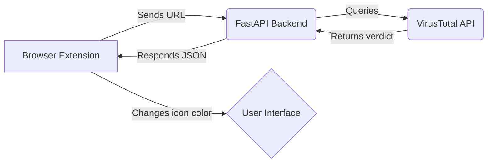

# 🛡️ SafeLink Inspector

[](LICENSE)
[]()
[]()
[]()

**SafeLink Inspector** is a Chrome extension with a FastAPI backend that checks URLs through the [VirusTotal API](https://www.virustotal.com).  
It highlights links on web pages and warns users about potentially malicious URLs.  
An educational cybersecurity project by **Yuriy Sokolov (Kvazilliano)**.

---

## ⚙️ 1. Using the Extension (with the public backend)

If you only want to **use the Chrome extension** and connect to the existing backend (for example, hosted at `https://kvazilliano.online/api/check`), follow these steps:

### 🔹 Step-by-step installation

1. **Download or clone** the repository:
   ```bash
   git clone https://github.com/sokoloffnik/SafeLink-Inspector.git
   ```

2. Open **Google Chrome** (or any Chromium-based browser like Edge or Brave).

3. Go to:
   ```
   chrome://extensions/
   ```

4. Turn on the **Developer mode** (top right corner).

5. Click **Load unpacked** and select the folder:
   ```
   extension/
   ```

6. Once loaded, you’ll see the SafeLink Inspector icon appear in the toolbar.

7. The extension will automatically send visited URLs to the backend for scanning:  
   - 🟢 Clean → Safe website  
   - 🟡 Pending → Not yet verified  
   - 🔴 Malicious → Detected by VirusTotal  

---

### 🔧 Optional configuration
If you want to use your own backend, edit the API endpoint in:
```
extension/background.js
```
Replace:
```js
const response = await fetch("https://kvazilliano.online/api/check", { ... });
```
with your own server URL.

---

## 🧠 2. Running Your Own Backend

If you want to **deploy your own FastAPI backend**, here’s how.

> 🧩 **Important:** The contents of the `backend/` folder must be placed inside a directory named **`safelink/`** so the internal Python imports work correctly.

### 📂 Project structure
```
safelink/
├── app/
│   ├── main.py
│   ├── requirements.txt
│   └── ...
├── Caddyfile
├── docker-compose.yml
```

### 🚀 Run with Docker
```bash
cd backend
docker-compose up -d
```
This will:
- Build the FastAPI app  
- Launch it behind a Caddy reverse proxy (with HTTPS)  
- Expose the API endpoint at `https://your-domain.com/api/check`

### 💻 Run locally (without Docker)
```bash
cd backend/app
pip install -r requirements.txt
uvicorn app.main:app --reload --host 0.0.0.0 --port 8000
```
Then the API will be available at:
```
http://localhost:8000/api/check
```

### 🧪 Test your endpoint
```bash
curl -X POST "http://localhost:8000/api/check"      -H "Content-Type: application/json"      -d '{"url": "https://example.com"}'
```
Expected response:
```json
{
  "status": "clean",
  "engine": "VirusTotal",
  "url": "https://example.com"
}
```

---

## 🧰 Tech Stack

| Component | Description |
|------------|--------------|
| **FastAPI** | Backend framework for URL scanning |
| **VirusTotal API** | Provides threat intelligence and reputation data |
| **Caddy** | Reverse proxy with automatic HTTPS |
| **Docker Compose** | Simplifies deployment |
| **Chrome Extension (MV3)** | Frontend for link highlighting and user interaction |

---

## 🧱 Architecture Diagram



---

## 📄 License

This project is licensed under the [MIT License](LICENSE).  
You are free to use, modify, and distribute it with attribution.

---

## ✨ Credits

Developed by **Nikita Sokolov (Sokoloffnik)**  
Educational project in **cybersecurity, browser automation, and API integration**.

